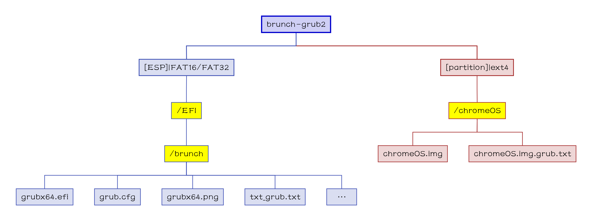

[English](README.md)|[简体中文](自述文件.md)|[繁體中文](繁體中文.md)|...
--|--|--|--

# brunch-grub2
这个是用来双启动甚至多启动，那些借助 [Brunch 框架](https://github.com/sebanc/brunch) 安装在 非 chromebook 的 chromeOS。
#### 文件结构树状图

## 💻️预览👀

🖱️点击展开查看🖱️

 

## 🧭指南⬇️
### 还没安装

🖱️点击展开查看🖱️

#### 使用 Brunch 框架
- 使用 [Brunch 框架](https://github.com/sebanc/brunch) 安装 chromeOS；
- 在 `ext4: /chromeOS` 中生成 `chromeOS.img` ，
- - `sudo bash chromeos-install.sh -src chromeos_filename.bin -dst .../[ext4_分区卷标]/chromeOS/chromeOS.img -s size`
#### 复制到 ESP 分区
- 复制文件夹 `zip: EFI/brunch` 到 `ESP: \EFI`；

### 已经安装好了

🖱️点击展开查看🖱️

#### 编辑 txt_grub.txt
- 打开并编辑 `zip: EFI/brunch/txt_grub.txt` ；

三选一|一类情况|二类情况|三类情况
--|--|--|--
条件|{如果文件在该目录}|{如果文件在其他目录}|{其他}
代码|txt_grub=/chromeOS/chromeOS.img.grub.txt|#txt_grub=//.img.grub.txt|### copy all text in the file, "img_name.img.grub.txt"  ### paste here below|
做什么|什么都不做|小心填写路径；删除此处的`#`；给一类情况添加`#`|复制文本文件 "img_name.img.grub.txt" 中的所有文本并且粘贴到此处下方；给一类情况添加`#`
#### 复制到 ESP 分区
- 复制文件夹 `zip: EFI/brunch` 到 `ESP: \EFI`；

## 📝FAQ❓️
### Back to Yours
这是 [Yours](https://github.com/M-L-P/Yours).

## ⭐收藏🌟
如果你喜欢并且期待未来的更新，你可以点亮星星。💫

## 🎉来源🎊
- 几乎所有文件来自 [Brunch Framework](https://github.com/sebanc/brunch);
